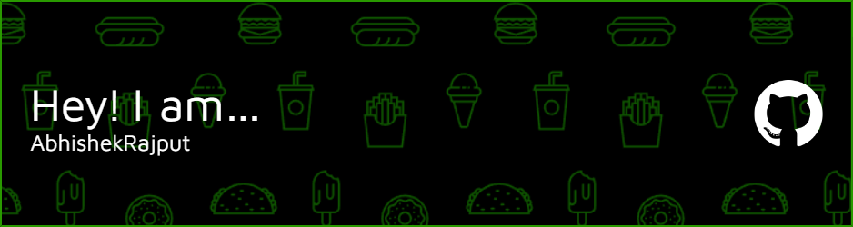

<!-- Banner -->
<!-- 

 -->

<b><h1 align="center">A Passionate Coder from India </h1></b>
<!-- </h1></b> -->

  

  

  
- 🔭 I’m currently working as an Intern at **Project Human City**

- 🌱 I’m currently learning **Django**

- 💬 Ask me about **Java, Python, C/C++, MySQL, MongoDB, DSA, Android Development, Bash Scripting, Git, Docker, AWS, HTML, CSS, JavaScript**

- 📫 How to reach me **jarnav2503@gmail.com**

<!-- Social Media -->
<h3 align="left">Connect with me:</h3>

<!--  -->

<h3 align="center">Programming Languages</h3>

  

<h3 align="center">Android and Web Development</h3>

  

<h3 align="center">DevOps</h3>

  

<h3 align="center">DB and Tools</h3>

  

<!-- Stats-->
<!-- 

 -->
<!-- Most Used Lang-->
<!-- 

 -->
<!-- Streak-->
<!-- 

 -->
 
<h2 align="left"> Github Stats 
  
<!--  -->

  

  

